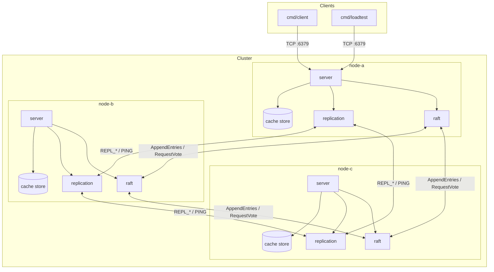
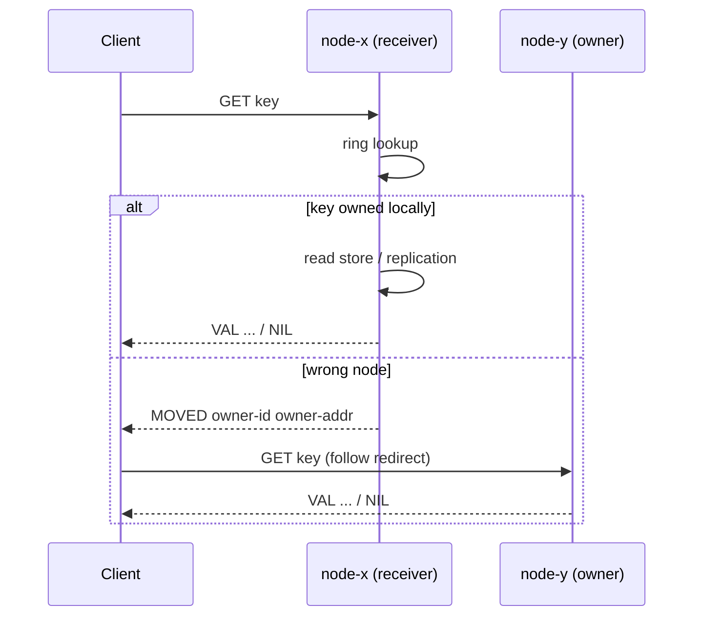
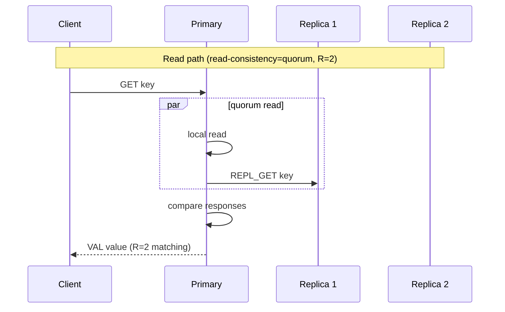
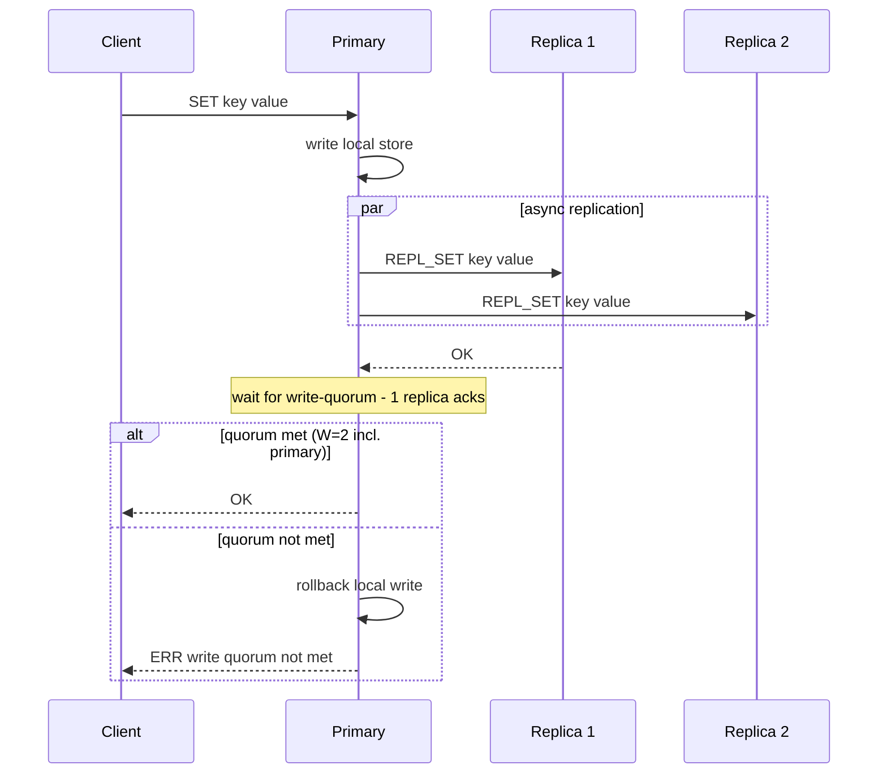
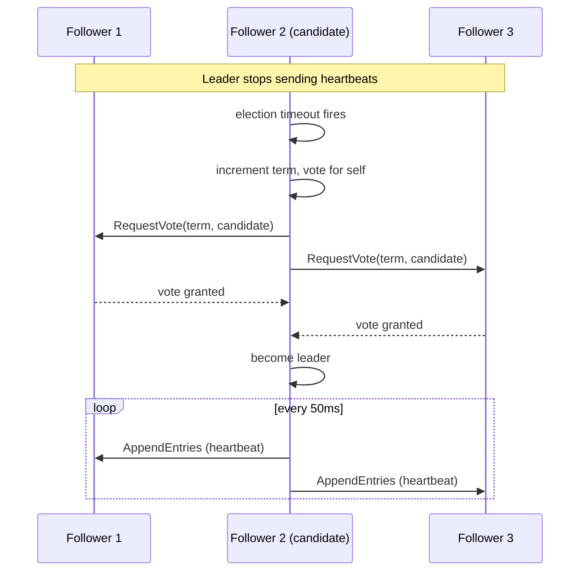
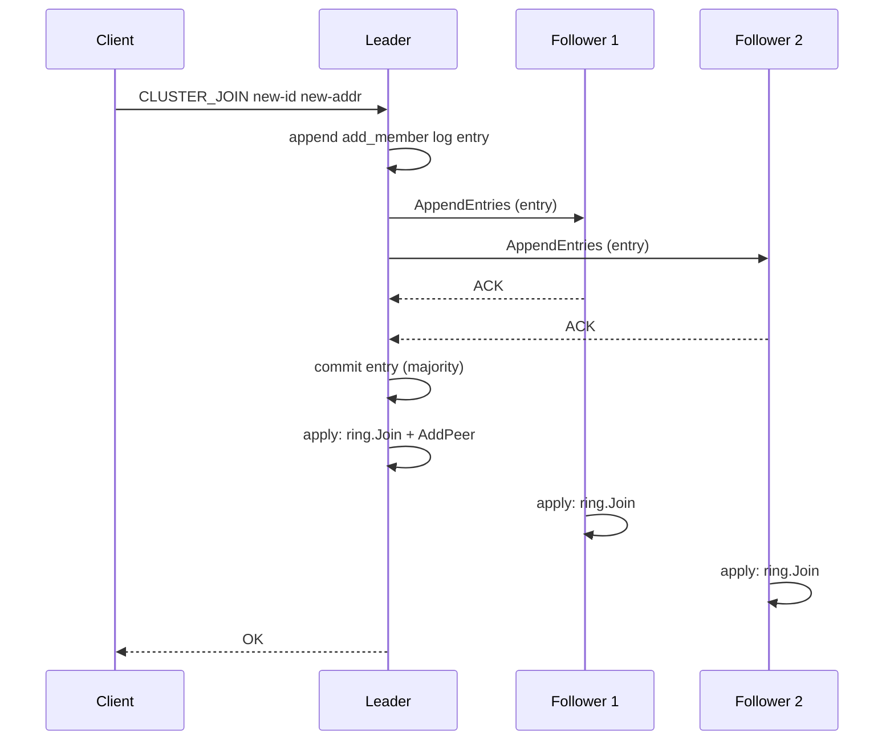

# Architecture

Design documentation for the distributed cache: cluster topology, request routing, replication, quorum writes, and Raft consensus.

## High-level cluster architecture

Each node runs three cooperating subsystems on top of an in-memory store:

1. **TCP server** — decodes the wire protocol, routes by hash ring ownership, exposes metrics
2. **Replication manager** — fan-out writes and quorum reads to peer nodes (when RF > 1)
3. **Raft node** — replicates membership log entries (when `-raft` is enabled)

Cache keys are partitioned by consistent hash. Replication places each key on the next *RF* nodes clockwise on the ring. Raft maintains the authoritative member list but does not replicate cache values.

The debug HTTP server (`-debug-addr`) is colocated on each node and serves `/healthz`, `/metrics`, `/discovery`, and Go pprof endpoints independently of cache TCP traffic.

---

## Request routing

Keys map to ring positions via FNV-1a hashing. Each physical node contributes virtual nodes (default 128) to reduce skew. `Owners(key, RF)` walks clockwise to find the primary and replicas.

| Mode | Write (SET/DEL) | Read (GET) |
|------|-----------------|------------|
| Standalone | Local store | Local store |
| RF=1 cluster | Primary owner; else `MOVED` | Owner; else `MOVED` |
| RF>1 cluster | Primary only; else `MOVED` | Must be in replica set; else `MOVED` to primary |

`OWNER` returns the primary without redirecting. `CLUSTER_MEMBERS` lists ring members. Raft commands (`CLUSTER_JOIN`, `CLUSTER_LEAVE`) require the leader; other nodes return `NOT_LEADER`.

Clients and the load generator follow up to five redirects per request.

---

## Replication flow

When `replication-factor > 1`, each key has a primary (first ring owner) and RF−1 downstream replicas. The primary coordinates all writes and selects read paths based on `read-consistency`.

Default for RF=3: **W=2**, **R=2** (`RF/2 + 1`).

Read modes:

- **primary** — only the primary serves reads
- **quorum** — parallel reads; majority must agree on value
- **any** — local first, then any healthy peer (may be stale)

Peer health is tracked by periodic `PING`. Unhealthy peers are excluded from quorum.

---

## Quorum write path

Writes always go through the primary. The primary applies locally first, then collects replica acknowledgements before confirming to the client. Failure to reach write quorum triggers a local rollback.

Write consistency modes control `RequiredWriteAcks()`:

| Mode | Replica ACKs required |
|------|---------------------|
| `one` | 0 (primary only) |
| `quorum` | `write-quorum - 1` (default) |
| `all` | `RF - 1` |

Implementation: `internal/replication/manager.go`.

---

## Raft leader election

Raft elects a single leader per term to serialize membership changes. Followers promote to candidate when heartbeats stop, then request votes from a majority.

Election parameters (`internal/raft` defaults):

- Election timeout: 150–300 ms (randomized per follower)
- Heartbeat interval: 50 ms
- Votes required: majority of cluster (`len(peers)/2 + 1`)

Only the leader accepts `CLUSTER_JOIN` and `CLUSTER_LEAVE`. Clients receive `NOT_LEADER` with the known leader address when contacting a follower.

---

## Membership consensus

Committed Raft log entries update the shared hash ring view on every node. Membership and cache data use separate mechanisms.

Log command types:

| Type | Trigger |
|------|---------|
| `add_member` | `CLUSTER_JOIN` |
| `remove_member` | `CLUSTER_LEAVE` |
| `noop` | Internal sentinel |

Apply callback (`cmd/node/main.go`): updates `cluster.Join` / `cluster.Leave` and the Raft transport peer map.

---

## Protocol summary

Length-prefixed text protocol (`internal/protocol`). Requests end with `END`.

**Client commands:** `SET`, `GET`, `DEL`, `PING`, `OWNER`, `CLUSTER_MEMBERS`, `CLUSTER_JOIN`, `CLUSTER_LEAVE`, `METRICS`, `RAFT_STATUS`

**Internal replication:** `REPL_SET`, `REPL_DEL`, `REPL_GET`

**Raft RPC:** `RAFT_REQUEST_VOTE`, `RAFT_APPEND_ENTRIES`

**Responses:** `OK`, `VAL`, `NIL`, `ERR`, `MOVED`, `OWNER`, `MEMBERS`, `NOT_LEADER`

---

## Deployment topology

Docker Compose default: three nodes, RF=3, Raft on.

| Service | Cache (host) | Debug (host) |
|---------|--------------|--------------|
| node-a | 6379 | 6060 |
| node-b | 6380 | 6061 |
| node-c | 6381 | 6062 |

Inside the bridge network, peers use `node-{a,b,c}:6379`. Host clients must remap redirect addresses. See [phase6-deployment.md](phase6-deployment.md).

---

## Further reading

- [failure-recovery.md](failure-recovery.md) — failure modes and guarantees
- [benchmarks.md](benchmarks.md) — measured performance
- [project-summary.md](project-summary.md) — interview-oriented overview
